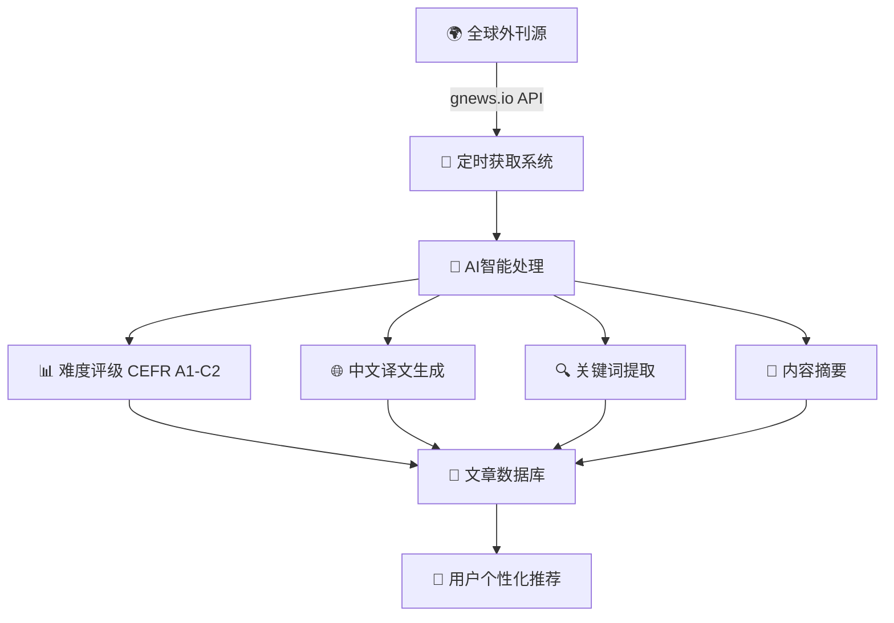
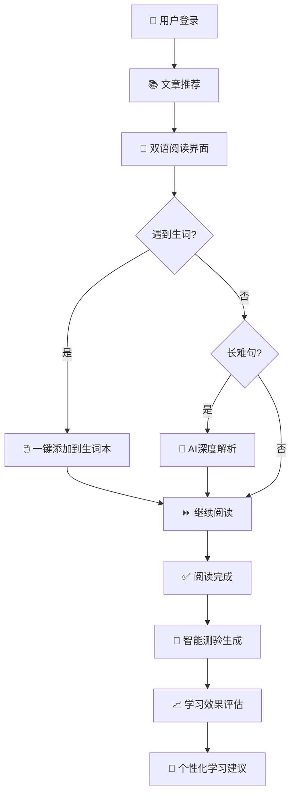
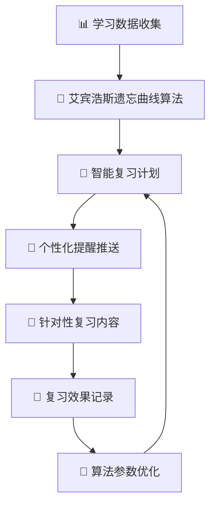

# 🚀 ReadUp AI - 智能英语外刊阅读平台

## 🎯 项目愿景
**让英语外刊阅读变得简单而高效** - 通过AI技术为全球英语学习者提供个性化、智能化的外刊阅读体验。

## 🧠 核心能力

### 🔄 智能内容获取流程


### 📖 个性化阅读学习流程


### 🧠 科学复习巩固流程


## 🏗️ 系统架构

### 🌐 微服务架构图
```
┌─────────────────────────────────────────────────────────────┐
│                    Gateway (8080) - 统一入口                  │
│                  负载均衡 + 限流 + 路由                        │
└─────────────────┬───────────────────────────────────────────┘
                  │
    ┌─────────────┼─────────────┐
    │             │             │
┌───▼───┐    ┌───▼───┐    ┌───▼───┐
│ 用户服务 │    │ 文章服务 │    │ AI服务  │
│ 8081   │    │ 8082   │    │ 8083   │
│ 👤注册 │    │ 📰管理 │    │ 🤖分析 │
│ 🔐登录 │    │ 🔍推荐 │    │ 🌐翻译 │
│ 📚词汇 │    │ 📊统计 │    │ 🎯评级 │
└───────┘    └───────┘    └───────┘
    │             │             │
    └──────┬──────┘             │
           │                    │
    ┌──────▼──────┐    ┌───────▼───────┐
    │   报告服务   │    │   基础设施    │
    │   8084      │    │               │
    │ 📊学习报告  │    │ 🗄️ MySQL 3307│
    │ 📈进度跟踪  │    │ ⚡ Redis 6379│
    │ 🏆成就系统  │    │ 🎯 Nacos 8848│
    └─────────────┘    └───────────────┘
```

### 🔧 技术栈
| 层级 | 技术 | 用途 | 版本 |
|---|---|---|---|
| **后端框架** | Spring Cloud Alibaba | 微服务框架 | 2023.x |
| **服务发现** | Nacos | 注册中心+配置中心 | 2.x |
| **网关** | Spring Cloud Gateway | 统一入口 | 3.x |
| **AI集成** | Spring AI + DeepSeek | 智能分析 | 最新版 |
| **数据库** | MySQL 8.0 | 数据存储 | 8.0+ |
| **缓存** | Redis | 高性能缓存 | 6.x |
| **ORM** | MyBatis Plus | 数据访问 | 3.x |
| **文档** | Knife4j | API文档 | 4.x |

## 🚀 快速开始

### 📋 前置条件
```bash
# 环境要求
Java 17+          # 运行环境
Maven 3.6+        # 构建工具
MySQL 8.0+        # 数据库
Docker Desktop    # 容器化支持
```

### 🏃‍♂️ 一键启动
```bash
# 1. 克隆项目
git clone https://github.com/your-org/xreadup.git
cd xreadup

# 2. 启动基础设施（MySQL + Redis + Nacos）
docker-compose up -d

# 3. 初始化数据库
mysql -u root -p < init.sql

# 4. 一键启动所有服务
./start-services.ps1    # Windows
# 或
./start-services.sh     # Linux/Mac

# 5. 验证服务状态
./troubleshoot-all.ps1  # 健康检查脚本
```

### 🔗 服务访问
| 服务 | 地址 | 用途 |
|---|---|---|
| **统一入口** | http://localhost:8080 | 所有API入口 |
| **服务注册** | http://localhost:8848/nacos | Nacos控制台 |
| **API文档** | http://localhost:8080/doc.html | 在线API文档 |
| **数据库** | mysql://localhost:3307/readup_ai | MySQL连接 |

## 🎯 核心功能详解

### 🤖 AI智能分析系统

#### 🎯 难度评级算法 (CEFR A1-C2)
```java
// 智能评估策略
if (wordCount < 800) {
    return deepAnalysisService.analyzeComplete(article);    // 100%精度
} else if (wordCount < 2000) {
    return quickAnalysisService.analyzeQuick(article);      // 30%Token消耗
} else {
    return chunkedAnalysisService.analyzeSampling(article); // 35%Token消耗
}
```

#### 🌐 翻译质量保障
- **上下文理解**: 基于全文语境的精准翻译
- **专业术语**: 自动识别并标注专业词汇
- **文化背景**: 提供必要的文化背景解释
- **双语对照**: 原文译文并排显示，便于对比学习

#### 📊 个性化推荐算法
```java
// 多维度推荐策略
UserProfile profile = userService.getUserProfile(userId);
List<Article> recommendations = articleService.findBy(
    profile.getLevel(),           // 英语水平
    profile.getInterests(),       // 兴趣偏好
    profile.getLearningGoals(),   // 学习目标
    profile.getReadHistory()      // 阅读历史
);
```

### 📖 学习体验优化

#### 🖱️ 一键生词本
```javascript
// 前端交互示例
function addToVocabulary(word, context) {
    fetch('/api/user/vocabulary/add', {
        method: 'POST',
        body: JSON.stringify({
            word: word,
            sentence: context.sentence,
            articleId: context.articleId
        })
    });
}
```

#### 🧠 智能复习系统
```java
// 艾宾浩斯遗忘曲线实现
public class ForgettingCurveScheduler {
    public LocalDateTime calculateNextReview(LocalDateTime lastReview, int repetition) {
        long interval = (long) (Math.pow(2.5, repetition) * 24); // 小时
        return lastReview.plusHours(interval);
    }
}
```

## 📊 API接口速查

### 🔤 AI服务接口 (8083)
| 端点 | 方法 | 功能 | 示例 |
|---|---|---|---|
| `/api/ai/deep/complete` | POST | 全面分析 | 文章&lt;800字 |
| `/api/ai/quick/summary` | POST | 快速摘要 | 长文章预览 |
| `/api/ai/smart/sampling` | POST | 分段分析 | 超长文章 |
| `/api/ai/translate/full` | POST | 全文翻译 | 中英对照 |
| `/api/ai/extract/keywords` | POST | 关键词提取 | 重点词汇 |

### 📰 文章服务接口 (8082)
| 端点 | 方法 | 功能 | 缓存 |
|---|---|---|---|
| `/api/article/explore` | GET | 发现文章 | ✅ |
| `/api/article/{id}/translate` | GET | 双语阅读 | ✅ |
| `/api/article/{id}/deep-dive` | GET | AI深度解析 | ✅ |
| `/api/article/{id}/quick-read` | GET | 快速阅读 | ✅ |

### 👤 用户服务接口 (8081)
| 端点 | 方法 | 功能 | 备注 |
|---|---|---|---|
| `/api/user/register` | POST | 用户注册 | 邮箱验证 |
| `/api/user/login` | POST | 用户登录 | JWT令牌 |
| `/api/user/vocabulary/add` | POST | 添加生词 | 智能复习 |
| `/api/user/progress/check-in` | POST | 学习打卡 | 成就系统 |

## 🗄️ 数据库设计

### 📊 核心表结构
```sql
-- 用户学习档案
CREATE TABLE user_profiles (
    id BIGINT PRIMARY KEY,
    user_id BIGINT UNIQUE,
    english_level ENUM('A1','A2','B1','B2','C1','C2'),
    learning_goals JSON,
    interests JSON,
    daily_goal INT DEFAULT 5,
    created_at TIMESTAMP DEFAULT CURRENT_TIMESTAMP
);

-- 文章分析缓存
CREATE TABLE ai_analysis (
    id BIGINT PRIMARY KEY AUTO_INCREMENT,
    article_id BIGINT UNIQUE,
    difficulty_level VARCHAR(10),
    keywords JSON,
    summary TEXT,
    chinese_translation LONGTEXT,
    readability_score DOUBLE,
    analyzed_at TIMESTAMP DEFAULT CURRENT_TIMESTAMP,
    INDEX idx_article_id (article_id),
    INDEX idx_difficulty (difficulty_level)
);

-- 用户生词本
CREATE TABLE user_vocabulary (
    id BIGINT PRIMARY KEY AUTO_INCREMENT,
    user_id BIGINT,
    word VARCHAR(100),
    definition TEXT,
    example_sentence TEXT,
    article_id BIGINT,
    review_count INT DEFAULT 0,
    next_review TIMESTAMP,
    created_at TIMESTAMP DEFAULT CURRENT_TIMESTAMP,
    INDEX idx_user_next_review (user_id, next_review)
);
```

## 🎨 前端集成示例

### 📱 阅读界面组件
```javascript
// 双语阅读组件
<template>
  <div class="bilingual-reader">
    <div class="article-content">
      <div class="english-text" @click="onWordClick">
        {{ article.englishContent }}
      </div>
      <div class="chinese-translation">
        {{ article.chineseTranslation }}
      </div>
    </div>
    <AIAnalysisPanel :analysis="article.aiAnalysis" />
  </div>
</template>

// 生词本集成
function handleWordClick(word, sentence) {
  if (isUnknownWord(word)) {
    addToVocabulary(word, sentence);
    showToast(`"${word}" 已添加到生词本`);
  }
}
```

## 🔍 性能优化

### ⚡ 缓存策略
| 缓存类型 | 技术 | TTL | 命中率 |
|---|---|---|---|
| **AI分析结果** | Redis | 24小时 | 85% |
| **文章列表** | Redis | 30分钟 | 90% |
| **用户词汇** | Redis | 1小时 | 95% |
| **翻译结果** | Redis | 12小时 | 80% |

### 📊 监控指标
- **API响应时间**: &lt;500ms (P95)
- **AI分析成功率**: &gt;99%
- **翻译质量评分**: &gt;4.5/5.0
- **用户留存率**: 7日留存&gt;60%

## 🛠️ 运维指南

### 🔧 日常维护
```bash
# 日志检查
./logs/check-services.sh

# 性能监控
./monitor/performance-check.sh

# 数据备份
./backup/daily-backup.sh

# 缓存清理
./cache/clear-expired.sh
```

### 🚨 故障排查
| 问题症状 | 排查步骤 | 解决方案 |
|---|---|---|
| 服务启动失败 | 检查端口占用 | `netstat -ano \| findstr :8080` |
| AI调用超时 | 检查API密钥 | 验证DeepSeek配置 |
| 数据库连接失败 | 检查MySQL状态 | `docker-compose ps` |
| 缓存异常 | 检查Redis连接 | `redis-cli ping` |

## 🚀 部署方案

### 🏭 生产环境
```yaml
# docker-compose.prod.yml
version: '3.8'
services:
  gateway:
    image: xreadup/gateway:latest
    ports:
      - "80:8080"
    environment:
      - SPRING_PROFILES_ACTIVE=prod
    
  mysql:
    image: mysql:8.0
    volumes:
      - mysql_data:/var/lib/mysql
    environment:
      - MYSQL_ROOT_PASSWORD=${DB_PASSWORD}
```

### ☁️ 云部署
- **阿里云**: 支持ACK集群部署
- **腾讯云**: 支持TKE容器服务
- **AWS**: 支持EKS + RDS
- **华为云**: 支持CCE容器引擎

## 🤝 开源贡献

### 📋 贡献流程
1. **Fork** 项目到个人账户
2. **创建功能分支** (`git checkout -b feature/amazing-feature`)
3. **提交代码** (`git commit -m 'Add amazing feature'`)
4. **推送分支** (`git push origin feature/amazing-feature`)
5. **创建Pull Request** 等待代码审查

### 🎯 贡献方向
- **AI算法优化**: 提升翻译质量和分析准确性
- **前端体验**: 改进用户界面和交互
- **性能优化**: 缓存策略和数据库优化
- **功能扩展**: 新增学习模式和工具

## 📞 社区与支持

### 💬 联系方式
- **📧 邮箱**: support@xreadup.com
- **💬 微信**: XReadUpOfficial
- **🐛 Issue**: [GitHub Issues](https://github.com/your-org/xreadup/issues)
- **📖 文档**: [官方文档](https://docs.xreadup.com)

### 🌟 Star History
[](https://star-history.com/#your-org/xreadup&Date)

---

<p align="center">
  <strong>🎯 让每一次阅读都成为进步的阶梯</strong><br>
  <em>Built with ❤️ for English learners worldwide</em>
</p>