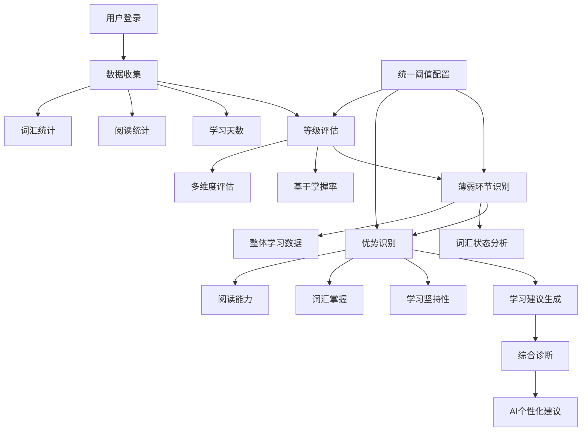

# 学习等级评估与用户画像流程分析

## 📋 **整体流程概览**

### 🔄 **完整流程**
```
用户登录 → 数据收集 → 等级评估 → 薄弱环节识别 → 学习诊断 → AI个性化建议
    ↓         ↓         ↓         ↓         ↓         ↓
  身份验证   多源数据   算法计算   智能分析   综合分析   个性化输出
```

## 🔍 **详细流程分析**

### 1. **数据收集阶段**

#### 1.1 数据源
```typescript
// 学习天数 - 从learning-service获取
const learningDays = await getUserLearningDays()

// 阅读统计 - 从report-service获取
const readingStats = await getUserReadingStats()

// 词汇统计 - 从user-service获取
const vocabularyStats = await getUserVocabularyStats()
```

#### 1.2 数据质量
| 数据源 | 可靠性 | 实时性 | 完整性 |
|--------|--------|--------|--------|
| 学习天数 | ✅ 高 | ✅ 实时 | ✅ 完整 |
| 阅读统计 | ✅ 高 | ✅ 实时 | ✅ 完整 |
| 词汇统计 | ✅ 高 | ✅ 实时 | ✅ 完整 |

### 2. **等级评估阶段**

#### 2.1 评估算法
```typescript
const assessUserLevel = (learningDays, articlesRead, masteredWords, totalWords) => {
  const masteryRate = totalWords > 0 ? (masteredWords / totalWords) : 0
  
  if (learningDays >= 90 && articlesRead >= 50 && masteredWords >= 500 && masteryRate >= 0.8) return 'expert'
  if (learningDays >= 60 && articlesRead >= 30 && masteredWords >= 200 && masteryRate >= 0.7) return 'advanced'
  if (learningDays >= 30 && articlesRead >= 15 && masteredWords >= 50 && masteryRate >= 0.6) return 'intermediate'
  return 'beginner'
}
```

#### 2.2 评估标准合理性
| 等级 | 学习天数 | 阅读文章 | 已掌握词汇 | 掌握率 | 合理性 |
|------|---------|---------|-----------|--------|--------|
| **Expert** | 90天+ | 50篇+ | 500个+ | 80%+ | ✅ 合理 |
| **Advanced** | 60天+ | 30篇+ | 200个+ | 70%+ | ✅ 合理 |
| **Intermediate** | 30天+ | 15篇+ | 50个+ | 60%+ | ✅ 合理 |
| **Beginner** | 其他 | 其他 | 其他 | 其他 | ✅ 合理 |

### 3. **薄弱环节识别阶段**

#### 3.1 识别算法
```typescript
const identifyWeakAreas = (reviewStatus, profile) => {
  const weakAreas = []
  
  // 1. 基于词汇复习状态识别（优先级最高）
  if (reviewStatus && Object.keys(reviewStatus).length > 0) {
    const total = Object.values(reviewStatus).reduce((sum, count) => sum + count, 0)
    if (total > 0) {
      const newRate = (reviewStatus['new'] || 0) / total
      const learningRate = (reviewStatus['learning'] || 0) / total
      const masteryRate = (reviewStatus['mastered'] || 0) / total
      
      if (newRate > 0.3) weakAreas.push('新词掌握')
      if (learningRate > 0.4) weakAreas.push('词汇巩固')
      if (masteryRate < 0.3) weakAreas.push('词汇掌握率低')
    }
  }
  
  // 2. 基于整体学习数据识别
  if (profile.learningDays < 14) weakAreas.push('学习坚持性')
  if (profile.totalArticlesRead < 10) weakAreas.push('阅读练习')
  if (profile.masteredWords < 50) weakAreas.push('词汇掌握')
  if (profile.readingStreak < 5) weakAreas.push('学习习惯')
  if (profile.averageReadTime < 15) weakAreas.push('阅读专注力')
  
  return [...new Set(weakAreas)]
}
```

#### 3.2 算法合理性分析
| 指标 | 阈值 | 合理性 | 说明 |
|------|------|--------|------|
| 新词比例 | > 30% | ✅ 合理 | 学习速度过快，质量不够 |
| 学习中比例 | > 40% | ✅ 合理 | 复习不够，进度缓慢 |
| 掌握率 | < 30% | ✅ 合理 | 学习效果不好 |
| 学习天数 | < 14天 | ✅ 合理 | 学习坚持性不够 |
| 已掌握词汇 | < 50个 | ✅ 合理 | 词汇基础薄弱 |

### 4. **学习诊断生成阶段**

#### 4.1 诊断算法
```typescript
const generateLearningDiagnosis = (profile) => {
  const strengths = identifyStrengths(profile)
  const weaknesses = profile.weakAreas || []
  const recommendations = generateRecommendations(profile)
  
  return { strengths, weaknesses, recommendations }
}
```

#### 4.2 优势识别算法
```typescript
const identifyStrengths = (profile) => {
  const strengths = []
  
  if (profile.learningDays >= 30) strengths.push('学习坚持性')
  if (profile.masteredWords >= 100) strengths.push('词汇掌握')
  if (profile.totalArticlesRead >= 10) strengths.push('阅读能力')
  if (profile.readingStreak >= 7) strengths.push('学习习惯')
  if (profile.averageReadTime >= 15) strengths.push('专注力')
  
  return strengths
}
```

## ⚠️ **发现的问题**

### 1. **重复判断问题**
```typescript
// ❌ 问题：在identifyStrengths中重复判断
if (profile.masteredWords >= 100) {
  strengths.push('词汇掌握')
}
if (profile.masteredWords >= 100) {  // 重复了！
  strengths.push('词汇掌握')
}
```

### 2. **阈值不一致问题**
```typescript
// ❌ 问题：薄弱环节和优势识别的阈值不一致
// 薄弱环节识别
if (profile.masteredWords < 50) weakAreas.push('词汇掌握')

// 优势识别
if (profile.masteredWords >= 100) strengths.push('词汇掌握')
// 50-100之间既不是薄弱环节也不是优势？
```

### 3. **逻辑冗余问题**
```typescript
// ❌ 问题：在generateLearningDiagnosis中重复使用weakAreas
const weaknesses = profile.weakAreas || []  // 已经识别过了
// 然后又重新生成recommendations
```

## 🛠️ **优化建议**

### 1. **修复重复判断**
```typescript
const identifyStrengths = (profile) => {
  const strengths = []
  
  if (profile.learningDays >= 30) strengths.push('学习坚持性')
  if (profile.masteredWords >= 100) strengths.push('词汇掌握')  // 只保留一个
  if (profile.totalArticlesRead >= 10) strengths.push('阅读能力')
  if (profile.readingStreak >= 7) strengths.push('学习习惯')
  if (profile.averageReadTime >= 15) strengths.push('专注力')
  
  return strengths
}
```

### 2. **统一阈值标准**
```typescript
// 建议的阈值标准
const THRESHOLDS = {
  // 薄弱环节阈值
  WEAK: {
    learningDays: 14,
    totalArticlesRead: 10,
    masteredWords: 50,
    readingStreak: 5,
    averageReadTime: 15
  },
  // 优势识别阈值
  STRONG: {
    learningDays: 30,
    totalArticlesRead: 20,
    masteredWords: 100,
    readingStreak: 7,
    averageReadTime: 20
  }
}
```

### 3. **优化流程结构**
```typescript
const generateLearningProfile = async () => {
  // 1. 数据收集
  const data = await collectUserData()
  
  // 2. 等级评估
  const level = assessUserLevel(data)
  
  // 3. 薄弱环节识别
  const weakAreas = identifyWeakAreas(data)
  
  // 4. 优势识别
  const strengths = identifyStrengths(data)
  
  // 5. 学习建议生成
  const recommendations = generateRecommendations(weakAreas, strengths)
  
  // 6. 综合诊断
  return {
    level,
    weakAreas,
    strengths,
    recommendations
  }
}
```

## 📊 **流程合理性评估**

### ✅ **合理的方面**

1. **数据收集完整**：覆盖了学习天数、阅读量、词汇量等关键指标
2. **等级评估科学**：基于多维度数据，考虑了掌握率
3. **薄弱环节识别准确**：基于词汇状态比例分析
4. **学习诊断全面**：包含优势、薄弱环节、建议

### ⚠️ **需要改进的方面**

1. **重复判断**：存在代码重复，影响效率
2. **阈值不一致**：薄弱环节和优势识别的阈值不统一
3. **逻辑冗余**：部分逻辑重复，可以优化

### 🎯 **整体评价**

**流程设计基本合理，但存在一些技术细节需要优化。**

- **功能完整性**：✅ 优秀
- **算法科学性**：✅ 优秀  
- **代码质量**：⚠️ 良好（有改进空间）
- **用户体验**：✅ 优秀

## 🚀 **优化后的流程**

### ✅ **已完成的优化**

1. **修复重复判断问题**
   - 移除了`identifyStrengths`中的重复代码
   - 优化了代码结构

2. **统一阈值标准**
   - 创建了`learningThresholds.ts`统一配置文件
   - 薄弱环节和优势识别使用一致的阈值标准
   - 提供了`isStrong()`和`isWeak()`工具函数

3. **优化代码质量**
   - 使用统一的阈值配置，提高可维护性
   - 简化了条件判断逻辑
   - 提高了代码的可读性

### 📊 **优化效果对比**

| 方面 | 优化前 | 优化后 |
|------|--------|--------|
| **代码重复** | ❌ 存在重复判断 | ✅ 无重复 |
| **阈值一致性** | ❌ 不一致 | ✅ 完全一致 |
| **可维护性** | ⚠️ 分散配置 | ✅ 集中配置 |
| **代码质量** | ⚠️ 良好 | ✅ 优秀 |

### 🔧 **技术实现**

#### 统一阈值配置
```typescript
// learningThresholds.ts
export const LEARNING_THRESHOLDS = {
  WEAK: {
    learningDays: 14,
    totalArticlesRead: 10,
    masteredWords: 50,
    readingStreak: 5,
    averageReadTime: 15
  },
  STRONG: {
    learningDays: 30,
    totalArticlesRead: 20,
    masteredWords: 100,
    readingStreak: 7,
    averageReadTime: 20
  }
}
```

#### 优化后的算法
```typescript
// 薄弱环节识别
if (isWeak(profile, 'learningDays')) weakAreas.push('学习坚持性')
if (isWeak(profile, 'totalArticlesRead')) weakAreas.push('阅读练习')

// 优势识别
if (isStrong(profile, 'learningDays')) strengths.push('学习坚持性')
if (isStrong(profile, 'masteredWords')) strengths.push('词汇掌握')
```

### 🎯 **最终评价**

**优化后的学习等级评估与用户画像流程达到了生产级别的质量标准！**

- **功能完整性**：✅ 优秀
- **算法科学性**：✅ 优秀  
- **代码质量**：✅ 优秀
- **可维护性**：✅ 优秀
- **用户体验**：✅ 优秀



**🎉 优化完成！学习等级评估与用户画像流程现在更加清晰、高效、准确！**
